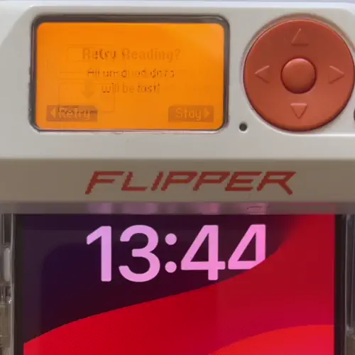
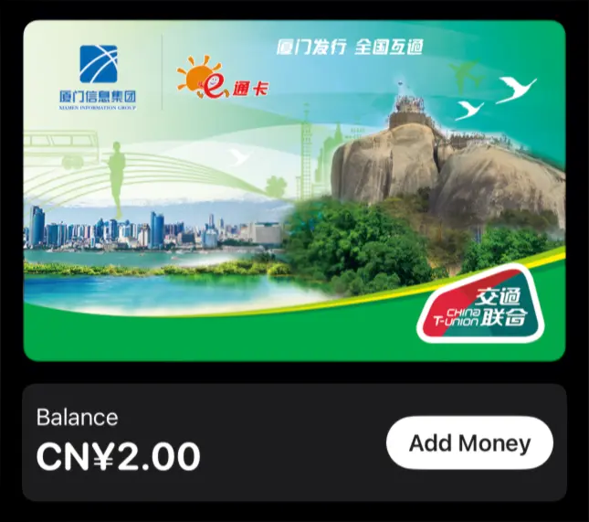
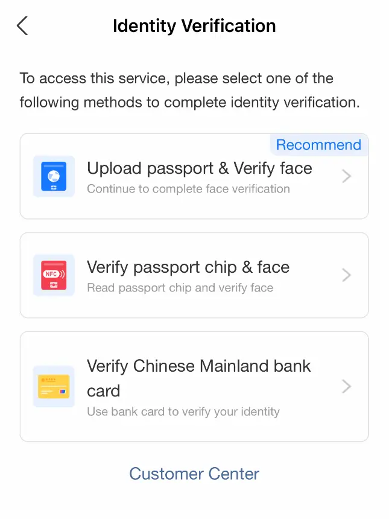
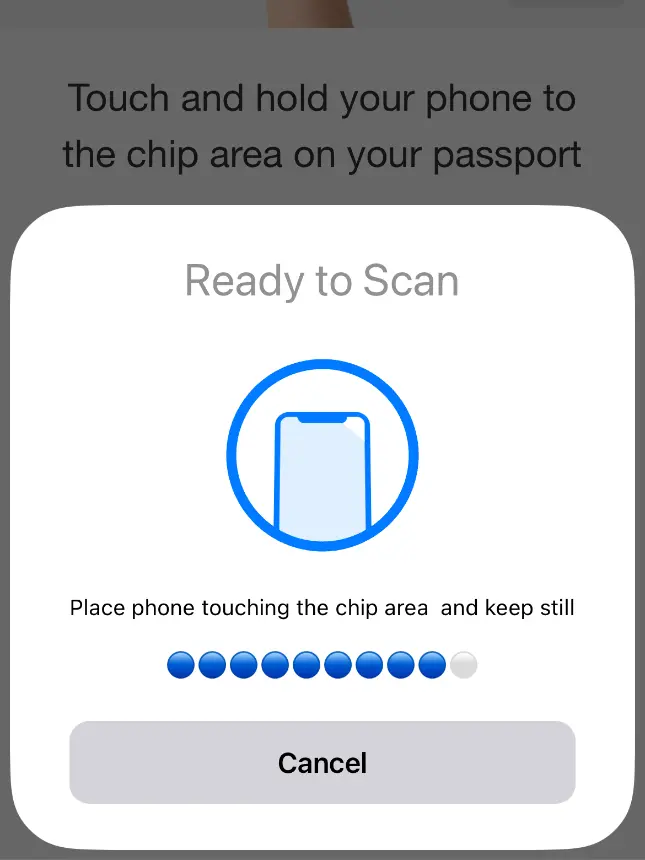
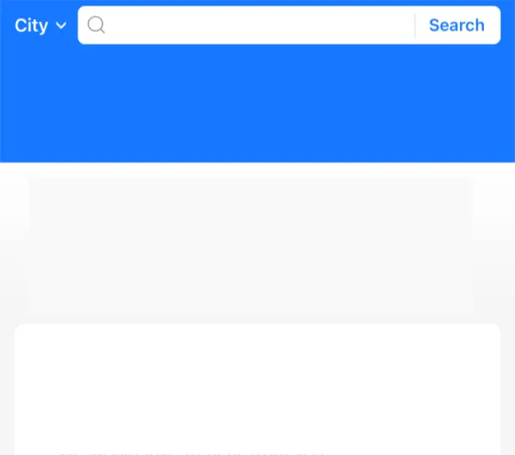
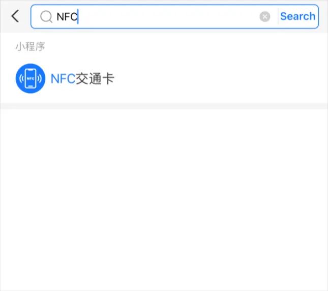
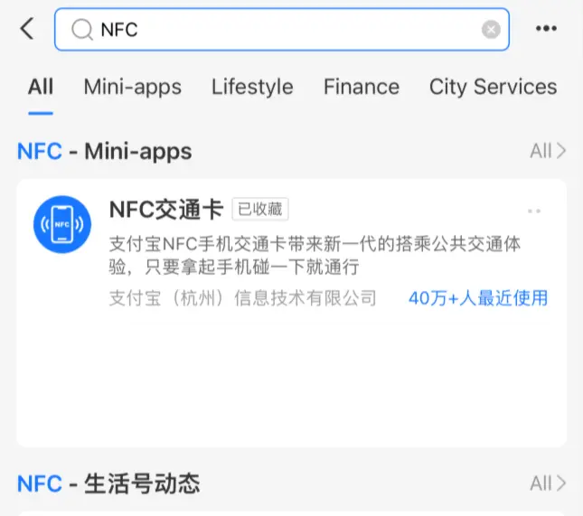
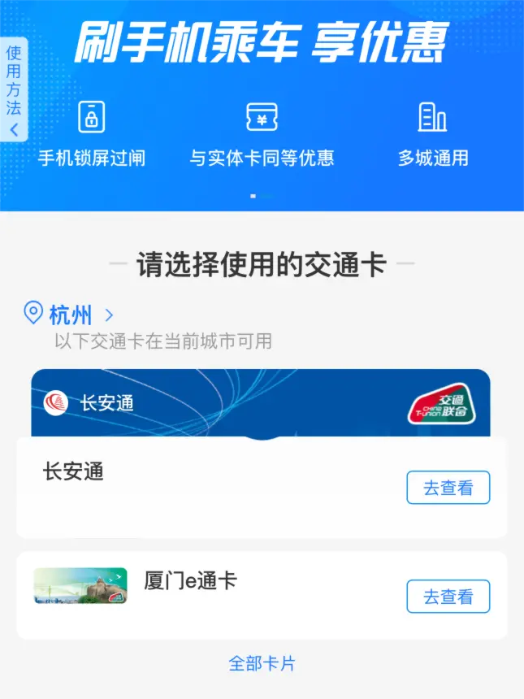
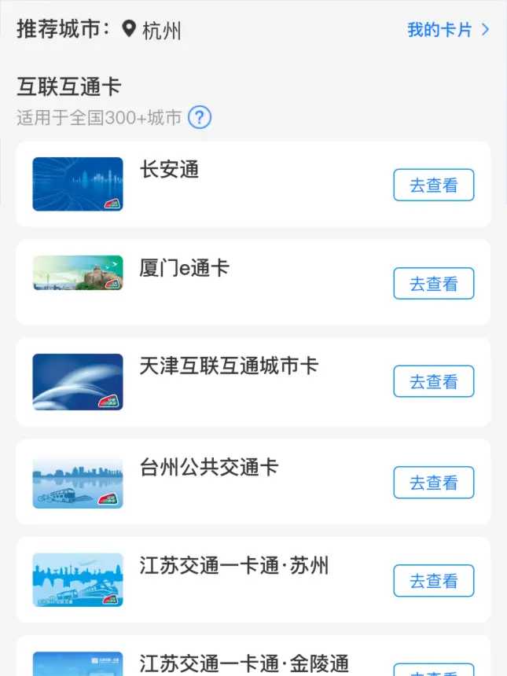
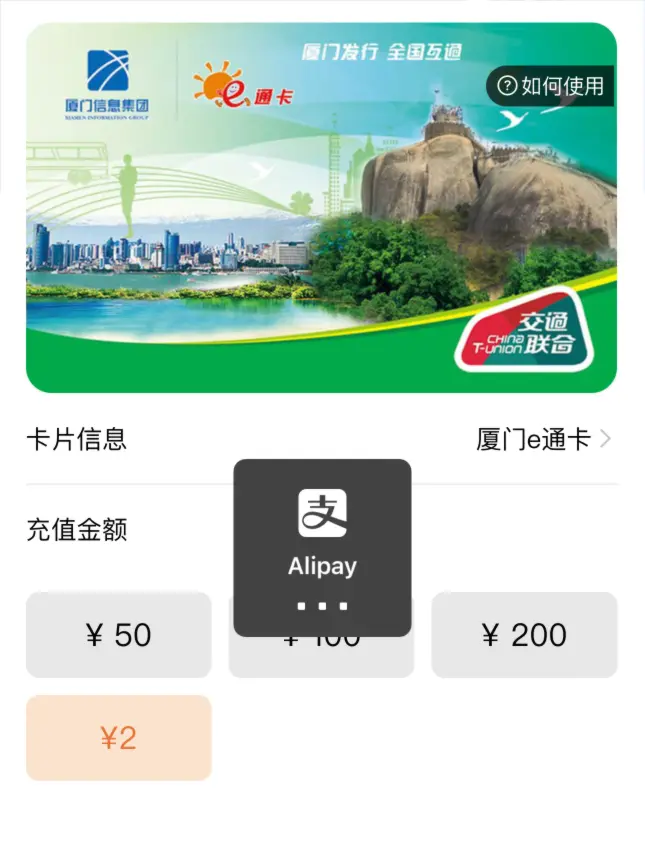

# Using your Apple device as an access card in unsupported systems

 

  
 Pay attention to the UID value 

# Overview

This repository describes general status on the topic and a possible solution to allow you to use your device as an access card in UID-based access systems (**without cloning, consent on behalf of maintainer will be required**).  
In case you've already tried researching this topic, feel free to skip the **Introduction** section straight to **The Solution**.

# Introduction

Many people have been beating their heads against the wall trying to use their Apple device as an access card.  

Sadly, due to a closed NFC and Wallet ecosystem, such a thing is not possibe to do on your own without any explicit support on the behalf of Apple and Access system manufacturer.  
Thankfuly, as of now this market request is starting to be fulfilled by the likes of Google, Apple with cooperation of Access reader manufacturers like [HID](https://campaigns.hidglobal.com/employee-badge), [Brivo](https://www.brivo.com/applewallet/) and [WaveLynx](https://www.wavelynxtech.com/credentials/apple-wallet), but ubiquitous support is far from reality. 

The search for a potential bypass had lead some people into the topics of [VAS](https://github.com/kormax/apple-vas), [ECP](http://github.com/kormax/apple-enhanced-contactless-polling) and (inexisting in IOS) HCE, but those solutions don't work with existing reader infrastructures.

# The solution

May be deemed more elegant than some people could expect.  
It lies in one of the Chinese transit card brands, called "China T-Union", that is officially supported by Apple Wallet.

  

At first look there's nothing special about this card type, it has the same charachteristics as any transit card in Wallet:  
- It has a viewable balance;  
- It has configurable express mode;
- It can be freely moved between devices.

What makes this card powerful, lies in the way it changes how NFC behaves on your device when it's set as a default transit card:
- Your device stops randomizing the UID on each tap;
- Your device begins responding to all NFC readers as if they were express-transit enabled, just like on Android; 
-  Also this card does not change its serial number and UID when moving to other devices, unlike most other ones.

All those properties are unique to this card type and cannot be replicated with any other card type, and coincidentally **they make it ideal for usage in access systems that use the UID of the card as the only means of authentication**.

Now, it's time to talk about the downsides. This is a point that might break the hopes for a lot of people:
- Thing is, UID-only authentication is deemed **very unsecure**, and thus is uncommon in real-life installations. Some installations allow UID auth in a fallback/compatability mode, which is more common.
- You cannot control the UID of the card that will be generated for you, this means that you'll still need to ask permission of the system owner to add your UID into it, a chance of getting a collision would be too little and too expensive to verify.

Following systems are known to have UID-based authentication:
- [UniFi Access](https://wiki.ui.com/2-0/docs/ua-nfc-cards) with the "UniFi Access Credentials Only" setting disabled;
- [Needs expanding].

In case the stars align in your case, a next question would be how to aquire such a card. Next section tries to answer that question.

# The solution for solution

China T-Union cards are quite hard to get, as if you've tried adding one straight from Wallet, you've probably encountered an error message telling you that you have to have a Chinese UnionPay card. Emphasis on Chinese, as global variants aren't accepted too. 

To overcome this problem, you have to have following prerequisites:
- [A Biometric travel document](https://en.wikipedia.org/wiki/Biometric_passport);
- A valid Mastercard or Visa.

(NOTE) Google says that many people are having issues with SMS verification, so this method might not be working now. In this case the only thing left is to wait for this issue to resolve.

If you have everything, follow the next steps:
1. Install the AliPay app;
2. Register inside the AliPay app:
    - Verify your mobile phone;
    - When asked, set up the PIN. **Warning** it is very important not to forget any of the codes, as you'll irreversibly lose access to your account;
3. Verify your identity:  
    1. Select "Account" tab;
    2. Tap on the profile avatar;
    3. Select "My Namecard";
    4. Press "Verify identity";
    5. Choose "Complete verification".  

    After that, you'll be presented with a couple of possible age verification methods.  
    Depending on your country one of them may work for you.
    

    
    
    
 
    Thanks to @ihrapsa for providing images and directions for this step
4. On the main page, tap on a search bar, search for "NFC". An icon with "NFC" should appear, tap on it;  
    

    
    
    
    
  
5. Follow the onboarding screens. In case you're unsure about the UI elements, make a screenshot and feed it into a translator app;
    

    
    
  
6. When reaching the screen with card selection, choose any. Beware that some have different minimum topup amounts.
    

    
    
  
7. After selection, choose topup amount, pay for a card. Go to the next screen;
    

    
    
  
8. An apple wallet popup should trigger, inviting you to provision the new card. Follow the steps as usual.

Having done all these steps, you should have a magic card in your Wallet. Use as you will. Good luck!

# Notes

- If you find any mistakes/typos or have extra information to add, feel free to raise an issue or create a pull request.

# References

* Resources that helped with research:
    - Access systems that support the lifehack:
        - [UniFi Access](https://wiki.ui.com/2-0/docs/ua-nfc-cards) - with the "UniFi Access Credentials Only" setting disabled;
    - Officially supported access system brochures:
        - [HID](https://campaigns.hidglobal.com/employee-badge);
        - [Brivo](https://www.brivo.com/applewallet/);
        - [WaveLynx](https://www.wavelynxtech.com/credentials/apple-wallet);
    - Other links:
        - [Biometric documents](https://en.wikipedia.org/wiki/Biometric_passport).
